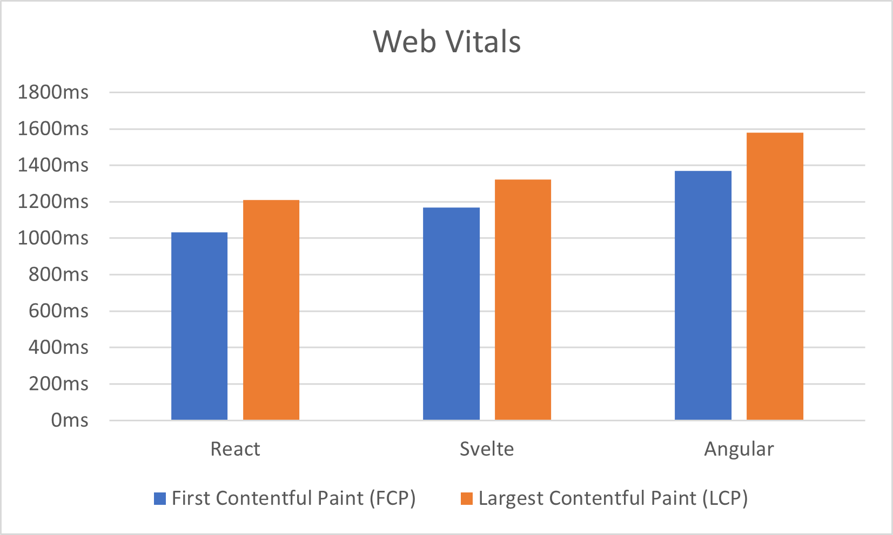
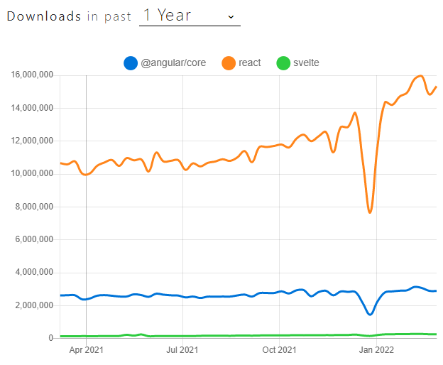

# Findings

## TL;DR

For the impatient, you can jump straight to the [conclusion](#conclusion).
## Bundle Sizes

| Framework | Bundle Size (raw) | Bundle Size (gzip) |
| :-------: | :---------------: | :----------------: |
|  Angular  |      520 KB       |       134 KB       |
|   React   |      492 KB       |       119 KB       |
|  Svelte   |      353 KB       |       76 KB        |

## Performance

| Framework | Performance - Lighthouse |             DevTools Performance             |
| :-------: | :----------------------: | :------------------------------------------: |
|  Angular  |            59            |  |
|   React   |            96            |    |
|  Svelte   |            97            |   |

### Web Vitals

### Usage Trends

### Other

Another interesting metric we gathered was lines of code (non-comment, non-whitespace)
involved in building the sample application. In other words, how many lines of code
did the engineer need to touch in order to build this app?

Alone, this is not a good metric, but put together with other measurements
could be a useful indicator of development experience and ease-of-use.

| Framework | Lines of code |
| :-------: | :-----------: |
|  Angular  |   504 lines   |
|   React   |   531 lines   |
|  Svelte   |   336 lines   |

Don't read too much into these numbers, as alone they don't mean much.

## Pros/Cons

Each library had its own set of pros/cons. Let's look at each of them:

### Angular

Pros

- ✔ Component-based
- ✔ Provides everything you need out-of-the-box (e.g. routing, forms, etc.)
- ✔ High adoption, 3rd overall behind Vue
- ✔ Written & maintained by Google

Cons

- ❌ Steeper learning curve
- ❌ More complex than other solutions
- ❌ Poorer size and performance
- ❌ [Poor developer satisfaction](https://2021.stateofjs.com/en-US/libraries/front-end-frameworks/#front_end_frameworks_experience_ranking)

### React

Pros

- ✔ Component-based
- ✔ Industry-standard (1st in overall usage), large & active community
- ✔ Easy to learn and use
- ✔ Powerful and customizable
- ✔ Performant and fast
- ✔ Hooks are very powerful

Cons

- ❌ Virtual DOM makes using Web Components difficult
- ❌ JSX is required for a decent developer experience
- ❌ Hooks aren't easy for new developers to understand

### Svelte

Pros

- ✔ Component-based
- ✔ Provides value at compile-time, rather than runtime
- ✔ Incredibly small and performant
- ✔ Easy to learn and use
- ✔ Natively uses Observer patterns (RxJS-compatible)
- ✔ Works well with Web Components
- ✔ Fewest lines of code to implement
- ✔ Fewer complex lifecycle events than other frameworks

Cons

- ❌ New, with a smaller community
- ❌ Has less maturity than other frameworks

## Conclusion

Svelte has excellent performance characteristics, very good developer experience, and is actively maintained.
In particular, the experience around using Web Components is very good, especially when compared to React,
which presents a fairly poor experience with Web Components. Despite the fact that Svelte is new and not as
well-adopted as its competitors, its developer experience, performance characteristics and simplicity are
all excellent reasons to adopt Svelte.

That said, if you value the proven success of React, its huge community, and the wide array of tooling
available for it, then React is a close 2nd choice. If you plan to utilize Web Components (e.g. from a
Design System), then Svelte will provide a better experience.

## *Svelte is the recommended frontend library moving forward*,

with React coming in at a close 2nd place.
