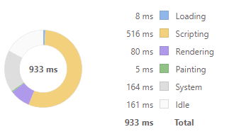

# Findings

## Bundle Sizes

| Framework | Bundle Size (raw) | Bundle Size (gzip) |
| :-------: | :---------------: | :----------------: |
|  Angular  |      520 KB       |       134 KB       |
|   React   |      492 KB       |       119 KB       |
|  Svelte   |      353 KB       |       76 KB        |

## Performance

| Framework | Performance - Lighthouse |             DevTools Performance             |
| :-------: | :----------------------: | :------------------------------------------: |
|  Angular  |            59            |  |
|   React   |            96            |    |
|  Svelte   |            97            |   |

### Web Vitals

### Other

Another interesting metric we gathered was lines of code (non-comment, non-whitespace)
involved in building the sample application. In other words, how many lines of code
did the engineer need to touch in order to build this app?

Alone, this is not a good metric, but put together with other measurements
could be a useful indicator of development experience and ease-of-use.

| Framework | Lines of code |
| :-------: | :-----------: |
|  Angular  |   504 lines   |
|   React   |   531 lines   |
|  Svelte   |   336 lines   |

Don't read too much into these numbers, as alone they don't mean much.

## Pros/Cons

Each library had its own set of pros/cons. Let's look at each of them:

### React

Pros
- ✔ Industry-standard, well-supported, the most popular framework
- ✔ Easy to learn and use
- ✔ Hooks are powerful and customizable
- ✔ High performance

Cons
- ❌ Using Web Components is difficult, as React uses the Virtual DOM and synthentic events aren't compatible with native web component events
- ❌ Building and customizing page templates isn't easy or simple
- ❌ Integrating with RxJS isn't out-of-the-box

### Angular

Pros
- ✔ Provides everything you need, including form management (Reactive Forms) and routing
- ✔ More difficult to put together, needed more in-depth knowledge of the innards of Angular

Cons
- ❌ Poorer performance
- ❌ Less developer satisfaction (according to 2021 stateofjs.com report)